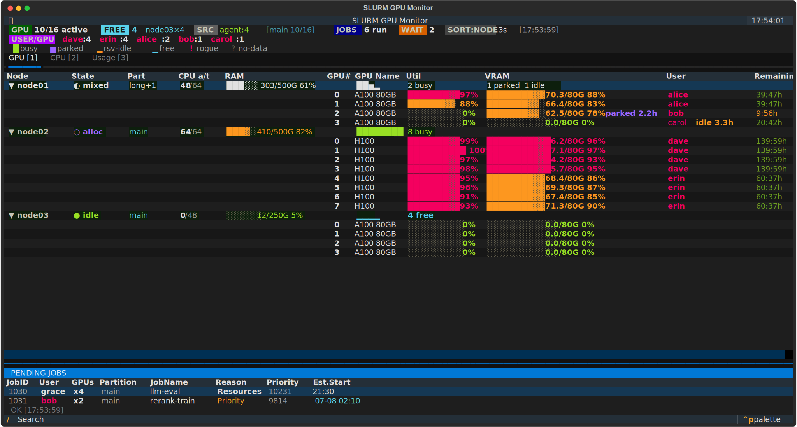
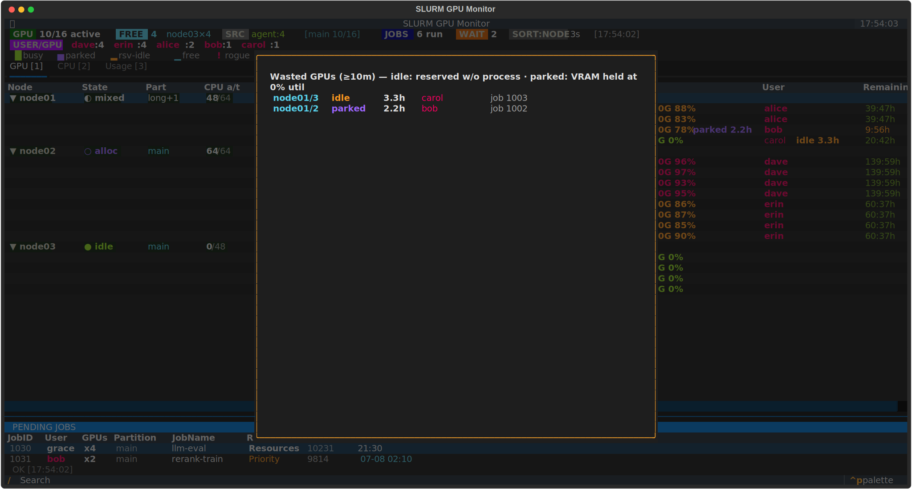
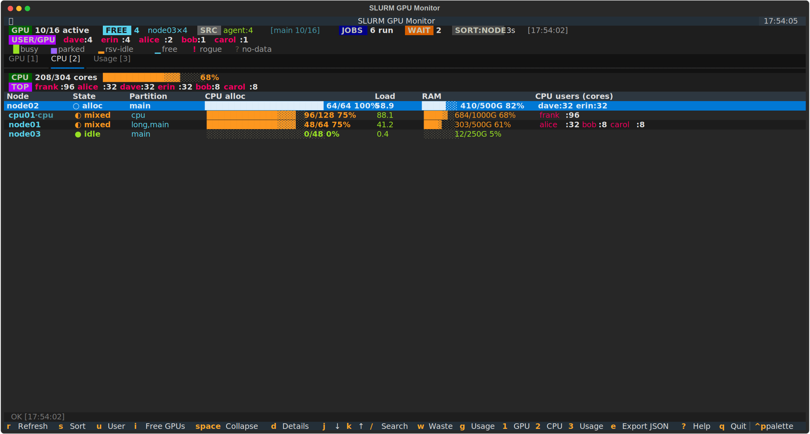
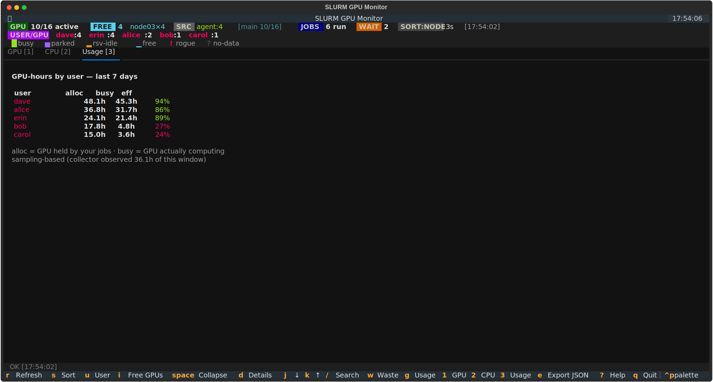
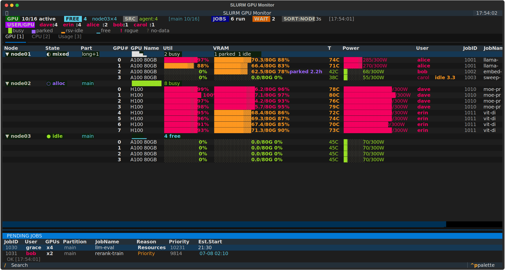

<div align="center">

# sgpu

**Real-time SLURM GPU operations monitor**
terminal TUI · collector daemon · push agents · usage/waste accounting · Slack alerts


[한국어 README](README_ko.md)

</div>

<p align="center"></p>

<table>
<tr>
<td width="50%" align="center"><br>
<sub><b>Wasted GPUs (w)</b> — idle / parked / rogue, worst first</sub></td>
<td width="50%" align="center"><br>
<sub><b>CPU tab (2)</b> — every node incl. CPU-only, per-user cores</sub></td>
</tr>
<tr>
<td width="50%" align="center"><br>
<sub><b>GPU-hours by user (3)</b> — allocation vs compute, efficiency %</sub></td>
<td width="50%" align="center"><br>
<sub><b>Detail columns (d)</b> — temperature, power, JobID, job name</sub></td>
</tr>
</table>

## Features

- Per-node GPU status (utilization, VRAM, temp, power) and CPU/RAM — GPUs
  matched to SLURM jobs even when driver probe order differs from `/dev/nvidiaN`
- Idle / parked / rogue GPU detection, pending queue with reasons and start estimates
- Per-user GPU-hours, efficiency, and wasted hours, backfilled from slurmdbd
- Slack alerts (node down/recovered, GPU health, waste/rogue) in a daily thread
- Prometheus metrics + bundled Grafana dashboard — **[docs/GRAFANA.md](docs/GRAFANA.md)**

## How It Works

Runs on a SLURM login/master node (Python 3.10+, `sinfo`/`squeue`, optionally
`sacct`) with passwordless SSH to compute nodes; GPU nodes need `nvidia-smi`.

```
[sgpu-agent @ each node] ──3/20s─→ <AGENT_DIR>/<node>.json   (shared FS push)
                                          │
[sgpu-collector @ master] ──merge──→  /tmp/slurm-gpu-tui/data.json
                                          ↑
[sgpu TUI]                ──reads──┘   (instant, no SSH on launch)
```

- **Push mode (preferred):** GPU agents push `nvidia-smi` data every 3s,
  CPU-only agents `/proc/meminfo` every 20s — no SSH in the hot path.
- **SSH-pull fallback:** nodes without a live agent are polled over SSH
  (ControlMaster-pooled, async). Modes mix freely; stale CPU payloads fall
  back to low-frequency SSH polling (`cpu-poll`).
- The TUI reads the merged JSON, so startup is instant at any cluster size.
- `sgpu doctor` is the first check after install or when data looks wrong.

## Installation

> **Already installed? Just run `sgpu`.**

One line to install or upgrade in place:

```bash
curl -fsSL https://raw.githubusercontent.com/eightmm/slurm-gpu-tui/main/bootstrap.sh | bash
```

Run as **root/sudo** for a system service and `/usr/local/bin/sgpu` for every
user; a non-root install sets up only your own user. Root installs also enable
NVIDIA persistence mode on GPU nodes (`SGPU_ENABLE_PERSISTENCE=0` to skip) and
provision CPU-only push agents on shared-FS setups (`SGPU_ENABLE_CPU_PUSH=0`
to skip).

**Install location** (`SGPU_INSTALL_DIR`): `~/.sgpu/app` for user installs; as
root, `/home/shared/sgpu` when `/home/shared` exists (shared FS → push mode
out of the box), else `/opt/sgpu` (SSH-pull). Override on the **`bash` side**
of the pipe — for push mode both paths must be on a shared FS mounted at the
same path on compute nodes:

```bash
curl -fsSL https://raw.githubusercontent.com/eightmm/slurm-gpu-tui/main/bootstrap.sh \
  | SGPU_INSTALL_DIR=/nfs/apps/sgpu SLURM_GPU_TUI_AGENT_DIR=/nfs/apps/sgpu-nodes bash
```

| Environment | Service |
|-------------|---------|
| root / sudo | system service + `/usr/local/bin/sgpu` for all users |
| no sudo, systemd `--user` | user service (auto-starts on login) + PATH line |
| no sudo, no systemd | background process + PATH line |

> Push mode details (root→node SSH, `root_squash` NFS): **[docs/PUSH.md](docs/PUSH.md)**

## Usage

```bash
sgpu        # launch the monitor
```

| Key | Action |
|-----|--------|
| `1` `2` `3` | Tabs: GPU / CPU / Usage |
| `r` / `s` | Refresh / cycle sort (Node → Util → User → Free) |
| `u` / `i` | Filter by user (me first) / free-GPU filter |
| `d` | Detail columns (Temp / Power / JobID / JobName) |
| `Space` / `j` `k` | Collapse node / move cursor |
| `/` | Search node or username (`Esc` clears) |
| `Enter` | Job / node details (`scontrol show`) |
| `w` | Wasted GPUs popup |
| `x` | Cancel job under cursor (own jobs, asks first) |
| `e` | Export snapshot as JSON |
| `?` / `q` | Help / quit |

The TUI pops toasts while open: your jobs starting/finishing, nodes going
down or recovering.

### One-shot CLI

```bash
sgpu --once          # plain-text snapshot (--json for JSON)
sgpu --waste [-v]    # idle/parked/rogue GPUs; exit 1 if any
sgpu doctor          # self-diagnosis: data, agents, slurm, sacct, webhook
sgpu --usage [days] [--daily]          # per-user GPU-hours + efficiency + waste
sgpu --jobs [days] [--user U]          # job history: outcomes, GPU-hours, waits
sgpu --report [YYYY-MM]                # markdown monthly report
sgpu --wait-free 2 --partition heavy   # block until 2 GPUs free
chkgpu               # one-shot user × node matrix with next-free ETA
```

### Reading the Display

```
▼ node01   ● idle   gpu_short   32/64   ████░░░░ 128/256G
               0   A100    ████████░  85%   █████░░  40/80G   72C   280W   eightmm  12345   2:30h
               1   A100    ░░░░░░░░░   0%   ░░░░░░░   0/80G   35C    45W
```

- **Node header**: name, state (`●` idle · `◐` mixed · `○` alloc · `✖` drain),
  partition, CPU alloc, RAM bar, per-GPU glyph strip
  (`█` busy · `▅` parked · `▂` reserved-idle · `▁` free · `!` rogue)
- **`user !gres` / `user !slurm` (red)**: rogue — GPU process with no SLURM
  allocation for that GPU
- **`user idle 3.2h`**: allocated but no process, bold yellow after 1h
- **Stale nodes**: `~timeout`, `~unreachable`, `~smi_err`

## Slack Alerts

Config is `~/.sgpu/webhook.json` (hot-reloaded); the installer sets it up and
`sgpu doctor` shows the active mode. Full setup: **[docs/ALERTS.md](docs/ALERTS.md)**

## Operations

```bash
systemctl status|restart sgpu-collector          # root install
systemctl --user status|restart sgpu-collector   # user install
journalctl -u sgpu-collector -f                  # logs (or /tmp/sgpu-collector.log)
```

| Symptom | Check |
|---------|-------|
| `sgpu` not found | `export PATH="$HOME/.sgpu/app/bin:$PATH"` |
| Slow startup every launch | collector not running |
| Node `~timeout` / `~unreachable` | `ssh <node>` from master fails |
| Node `~smi_err` / `~no_smi` | `ssh <node> nvidia-smi` |
| Anything else | `sgpu doctor` |

Reinstall cleanly by re-running the one-line install. Deploying from a dev
checkout? See `deploy.sh`. Uninstall (stops collector and agents, removes
services, data, install dir):

```bash
curl -fsSL https://raw.githubusercontent.com/eightmm/slurm-gpu-tui/main/uninstall.sh | bash
```

## Configuration

<details>
<summary><b>Environment variables</b> (defaults work out of the box)</summary>

| Variable | Default | Description |
|----------|---------|-------------|
| `SLURM_GPU_TUI_REFRESH_SEC` | `3` | TUI refresh interval |
| `SLURM_GPU_TUI_COLLECTOR_SEC` | `3` | Collector cycle interval |
| `SLURM_GPU_TUI_NODE_TIMEOUT_SEC` | `30` | SSH timeout per node |
| `SLURM_GPU_TUI_MAX_WORKERS` | `8` | Parallel SSH workers (fallback mode) |
| `SLURM_GPU_TUI_DATA_DIR` | `/tmp/slurm-gpu-tui` | Daemon JSON output dir |
| `SLURM_GPU_TUI_STATE_DIR` | `~/.sgpu/state` | Persistent state (usage, waste, inventory) |
| `SLURM_GPU_TUI_AGENT_DIR` | `~/.sgpu/nodes` | Push-agent payload dir (shared FS for push) |
| `SLURM_GPU_TUI_AGENT_SEC` | `3` | GPU agent interval |
| `SLURM_GPU_TUI_CPU_AGENT_SEC` | `20` | CPU-only agent interval |
| `SLURM_GPU_TUI_AGENT_MAX_AGE_SEC` | `45` | Agent payload freshness limit |
| `SLURM_GPU_TUI_AGENT_REPAIR_SEC` | `180` | Min interval between agent repairs per node |
| `SLURM_GPU_TUI_AGENT_DISABLE` | (unset) | Disable push agents entirely |
| `SLURM_GPU_TUI_WASTE_MIN_SEC` | `600` | Threshold for waste view / `--waste` |
| `SLURM_GPU_TUI_USAGE_KEEP_DAYS` | `30` | GPU-hour history retention |
| `SLURM_GPU_TUI_SACCT_SEC` | `3600` | slurmdbd backfill interval; `0` disables |
| `SLURM_GPU_TUI_WEBHOOK_URL` | (unset) | Slack webhook URL (full config: `~/.sgpu/webhook.json`) |
| `SLURM_GPU_TUI_SLACK_BOT_TOKEN` | (unset) | Slack bot token for daily-thread mode |
| `SLURM_GPU_TUI_WEBHOOK_DEBOUNCE_SEC` | `1800` | Min interval between repeated alerts |
| `SLURM_GPU_TUI_WEBHOOK_NAG_SEC` | `21600` | Re-alert interval for standing conditions |
| `SLURM_GPU_TUI_ROGUE_IGNORE` | `root,gdm,xdm` | Users never flagged as rogue |
| `SLURM_GPU_TUI_SHARE_SCRIPTS` | (unset) | Show every job's batch script to all users — **shares script contents (and secrets)** |

Install-time only: `SGPU_INSTALL_DIR`, `SGPU_ENABLE_PERSISTENCE` (`0` skips
GPU-node persistence), `SGPU_ENABLE_CPU_PUSH` (`0` keeps CPU telemetry on SSH
polling), `SGPU_SHARE_SCRIPTS`.

</details>
