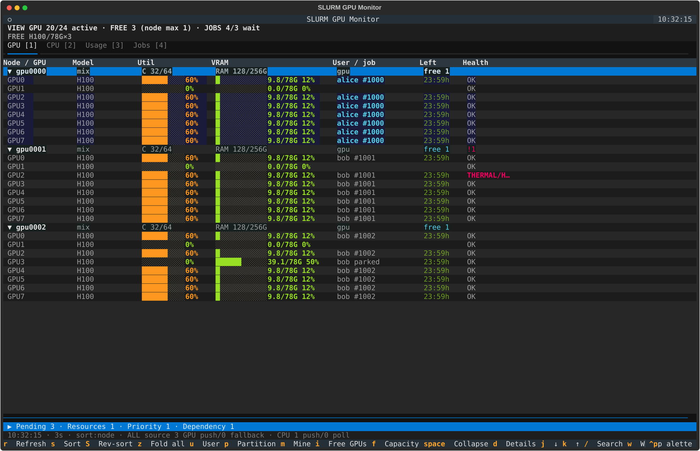
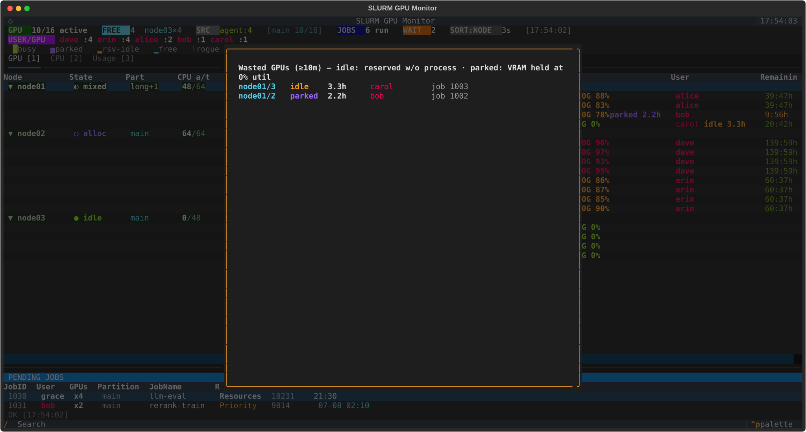
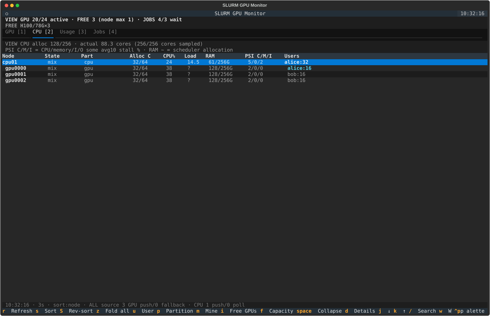
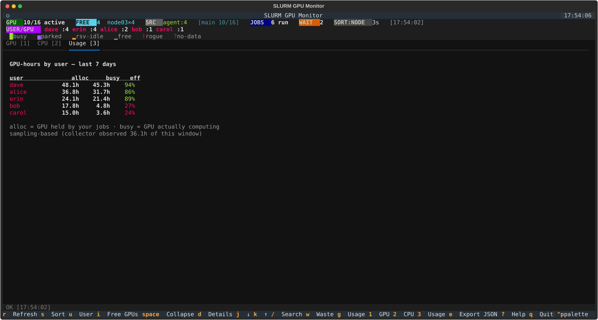
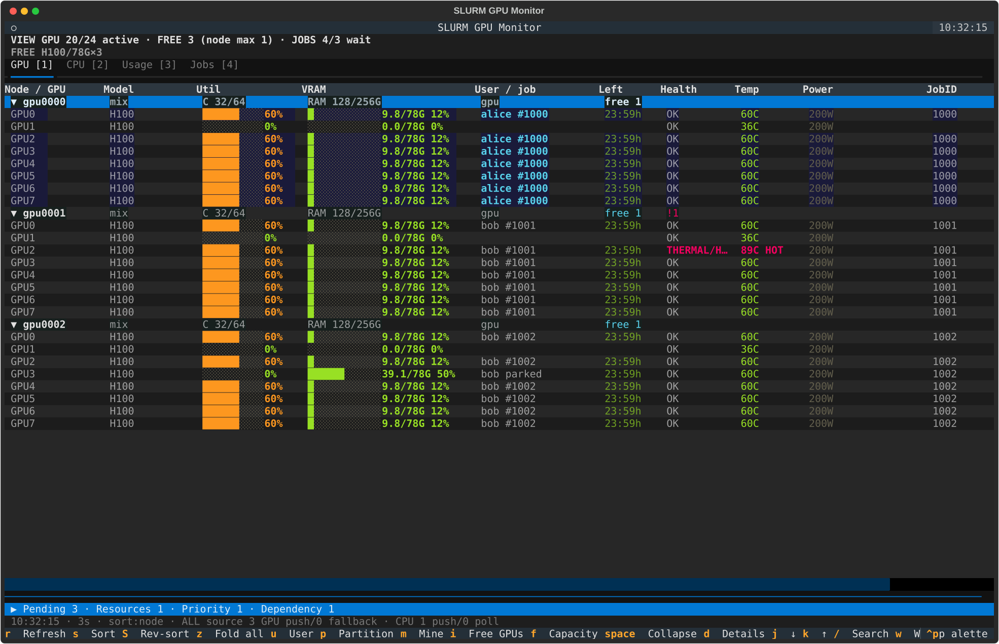
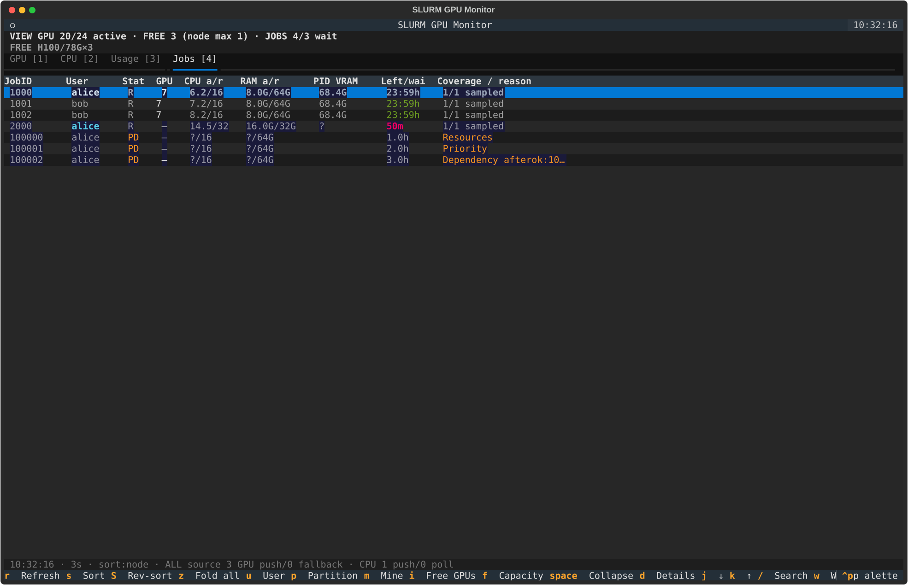

<div align="center">

# sgpu

**SLURM GPU 실시간 운영 모니터**
터미널 TUI · collector 데몬 · push 에이전트 · 사용량/낭비 집계 · Slack 알림


[English README](README.md)

</div>

<p align="center"></p>

<table>
<tr>
<td width="50%" align="center"><br>
<sub><b>낭비 GPU 팝업 (w)</b> — idle / parked / rogue, 심한 순</sub></td>
<td width="50%" align="center"><br>
<sub><b>CPU 탭 (2)</b> — CPU 전용 노드 포함, 유저별 코어</sub></td>
</tr>
<tr>
<td width="50%" align="center"><br>
<sub><b>유저별 GPU-hours (3)</b> — 할당 vs 실제 연산, 효율 %</sub></td>
<td width="50%" align="center"><br>
<sub><b>상세 열 (d)</b> — 온도, 전력, JobID, 잡 이름</sub></td>
</tr>
</table>

<p align="center"><br>
<sub><b>Jobs 탭 (4)</b> — GPU·CPU 작업과 대기 작업; 화면은 합성 데이터 예시다.</sub></p>

## 기능

- 노드별 GPU 상태(사용률, VRAM, 온도, 전력)와 CPU/RAM — 드라이버 probe
  순서가 `/dev/nvidiaN`과 달라도 GPU를 SLURM Job에 정확히 매칭
- idle / parked / rogue GPU 탐지, 대기 큐(이유 코드 + 예상 시작 시각)
- 유저별 GPU-hours, 효율, 낭비 시간 — slurmdbd에서 백필
- 잡 들여다보기: batch 스크립트 + stdout/stderr 탭(에러 줄 하이라이트,
  라이브 tail), CLI `sgpu logs`, 종료 코드 포함 sacct 히스토리(`h`),
  아무 잡이나 watch 걸어 시작/종료 토스트(`n`)
- Slack 알림(노드 다운/복구, GPU 헬스, 낭비/rogue, 실패 잡 stderr DM,
  RAM 공정몫 초과)을 일별 스레드로 묶고, 문제가 없는 날에도 부모 메시지
  하나를 게시 — **[docs/ALERTS.md](docs/ALERTS.md)**
- Prometheus 메트릭 + Grafana 대시보드 — 노드 전력(wall power), 멀티클러스터
  브리지, 전체 클러스터 오버뷰 포함 — **[docs/GRAFANA.md](docs/GRAFANA.md)**

## 동작 방식

SLURM 로그인/마스터 노드에서 운영(Python 3.10+, `sinfo`/`squeue`, 선택적으로
`sacct`). 컴퓨트 노드로 passwordless SSH 필요, GPU 노드에는 `nvidia-smi`.

```
[sgpu-agent @ each node] ──3/20s─→ <AGENT_DIR>/<node>.json   (shared FS push)
                                          │
[sgpu-collector @ master] ──merge──→  /tmp/slurm-gpu-tui/data.json
                                          ↑
[sgpu TUI]                ──reads──┘   (instant, no SSH on launch)
```

- **Push 모드 (권장):** GPU agent는 3초마다 `nvidia-smi` 데이터를, CPU 전용
  agent는 20초마다 `/proc/meminfo`를 push — 핫패스에 SSH 없음.
- **SSH-pull 폴백:** 살아있는 에이전트가 없는 노드는 SSH로 수집(ControlMaster
  풀, 비동기). 두 모드 자유 혼용; CPU payload가 stale이면 저빈도 SSH polling
  으로 폴백(`cpu-poll` 표시).
- TUI는 병합 JSON을 읽으므로 클러스터 규모와 무관하게 즉시 시작.
- 설치 후 또는 데이터 이상 시 첫 확인은 `sgpu doctor`.

## 설치

> **이미 설치된 서버라면? 그냥 `sgpu`.**

한 줄로 설치 또는 그 자리 업그레이드:

```bash
curl -fsSL https://raw.githubusercontent.com/eightmm/slurm-gpu-tui/main/bootstrap.sh | bash
```

**root/sudo**로 실행 시 시스템 서비스 + 모든 유저용 `/usr/local/bin/sgpu`;
일반 유저 설치는 본인 계정만 설정. root 설치는 추가로 매 설치 때 GPU 노드의
NVIDIA persistence mode를 활성화·재적용하고(`SGPU_ENABLE_PERSISTENCE=0`으로
생략), 다른 사용자 작업의 로그 tail과 정제된 Slurm 상세를 기본 공개하며
(`SGPU_SHARE_LOGS=0`, `SGPU_SHARE_JOB_DETAILS=0`으로 각각 해제), 공유 FS
환경이면 CPU 전용 노드에 push 에이전트를 배치한다
(`SGPU_ENABLE_CPU_PUSH=0`으로 생략).

**설치 위치** (`SGPU_INSTALL_DIR`): 유저 설치는 `~/.sgpu/app`; root는
`/home/shared`가 있으면 `/home/shared/sgpu`(공유 FS → push 모드 기본 동작),
없으면 `/opt/sgpu`(SSH-pull). 변경하려면 변수를 파이프의 **`bash` 쪽**에
붙일 것 — push 모드는 두 경로 모두 컴퓨트 노드가 같은 경로로 마운트하는
공유 FS에 있어야 한다:

```bash
curl -fsSL https://raw.githubusercontent.com/eightmm/slurm-gpu-tui/main/bootstrap.sh \
  | SGPU_INSTALL_DIR=/nfs/apps/sgpu SLURM_GPU_TUI_AGENT_DIR=/nfs/apps/sgpu-nodes bash
```

| 환경 | 서비스 |
|------|--------|
| root / sudo | 시스템 서비스 + 모든 유저용 `/usr/local/bin/sgpu` |
| sudo 없음, systemd `--user` | 유저 서비스(로그인 시 자동 시작) + PATH 추가 |
| sudo 없음, systemd 없음 | 백그라운드 프로세스 + PATH 추가 |

> push 모드 상세(root→노드 SSH, `root_squash` NFS): **[docs/PUSH.md](docs/PUSH.md)**

## 사용법

```bash
sgpu        # 모니터 실행
```

| 키 | 동작 |
|----|------|
| `1` `2` `3` `4` | GPU / CPU / Usage / Jobs 탭 |
| `v` / `t` | 대기 목록 펼치기 / 클러스터 추세 표시 (기본 접힘·숨김) |
| `f` | GPU 모델·VRAM별 FREE, 단일 노드 최대 수량과 노드 목록 |
| `r` / `s` | 새로고침 / 정렬 순환(노드 → 사용률 → 유저 → 빈 GPU) |
| `u` / `i` | 유저 필터(내가 첫 항목) / 빈 GPU 필터 |
| `p` / `m` | 파티션 필터 순환 / 내 잡만 보기 |
| `d` | 상세 컬럼(온도 / 전력 / JobID / JobName) |
| `Space` / `j` `k` | 노드 접기 / 커서 이동 |
| `/` | 노드명 또는 유저명 검색(`Esc` 초기화) |
| `Enter` | Job / 노드 상세(`scontrol show`) — `Tab`으로 Info / Script / StdOut / StdErr 전환 |
| `w` | 낭비 GPU 팝업 |
| `h` | 내 잡 히스토리(7일, sacct) — `Enter`: 상태, 종료 코드, 로그 |
| `n` | 커서 위치 잡 watch — 시작/종료 시 토스트 |
| `x` | 커서 위치 잡 취소(본인 잡, 먼저 확인) |
| `e` | 스냅샷 JSON 내보내기 |
| `?` / `q` | 도움말 / 종료 |

TUI는 열려 있는 동안 토스트도 표시: 내 잡 시작/종료, 노드 다운/복구.

### 원샷 CLI

```bash
sgpu --once          # 텍스트 스냅샷 (--json은 JSON)
sgpu --waste [-v]    # 유휴/parked/rogue GPU; 있으면 exit 1
sgpu doctor          # 자가진단: 데이터, 에이전트, slurm, sacct, Slack
sgpu --usage [일수] [--daily]          # 유저별 GPU-hours + 효율 + 낭비
sgpu --jobs [일수] [--user U]          # 잡 히스토리: 결과, GPU-hours, 대기
sgpu logs JOBID [-f] [-e]              # 잡 stdout 꼬리 보기 (-e: stderr, -f: 따라가기)
sgpu --report [YYYY-MM]                # 월간 리포트(마크다운)
sgpu --wait-free 2 --partition heavy   # 빈 GPU 2개 생길 때까지 대기
sgpu fit 2 --vram 40 --model h100 --cpus 16 --ram 64 --partition P --explain
                                     # 자원 조건 + 탈락 사유 + sbatch 예시
sgpu bench --nodes 128 --repeat 5      # 오프라인 합성 TUI 갱신 벤치마크
sgpu bench --replay snapshot.json     # 내보낸 스냅샷의 오프라인 재생
sgpu me              # 내 잡 · 내 낭비 GPU · 최근 7일 (낭비 있으면 exit 1)
chkgpu               # 원샷 유저×노드 매트릭스 + next-free 예상시각
```

`fit` 옵션은 모두 선택 사항이며 VRAM·RAM 단위는 GiB다. `--model`에는
Slurm GRES의 정확한 타입(예: `h100`)을 넣는다. CPU·RAM은 실제 프로세스
사용량 대신 스케줄러 할당량을 사용하고 오래된 텔레메트리는 제외한다.
결과는 용량 추정이며 예약·QOS·스케줄러 정책이 최종 실행 여부를 결정한다.
`bench`는 Slurm·SSH·네트워크를 호출하지 않는다. 재생 입력은 내보낸 스냅샷
한 개, JSON 배열, `{"snapshots": [...]}` 중 하나이며 최대 64 MiB다.
결측값이나 stale 노드가 포함된 스냅샷도 재생할 수 있다. 시간은 `_apply`만
측정하고 JSON 해석·비동기 화면 그리기는 제외한다. clear 횟수로 테이블
재구축 여부를 확인할 수 있다.

### 화면 구성

```
Node / GPU   Util    VRAM       User / job         Left     Health
▼ node01     mix    █▁         A100               free 1
  GPU0       85%    40.0/80G   alice #12345       2.3h      OK
  GPU1        0%     0.0/80G                             OK
▶ Pending 12 · Resources 8 · Priority 4 [v]
```

- **반응형 화면**: 130열 미만에서는 사용률·VRAM을 숫자로 표시하고 모델을
  노드 헤더로 옮긴다. Enter에서 CPU/RAM·파티션·하드웨어 상태·프로세스를
  확인한다. 대기 목록은 기본 접힘이며 `v`로 펼친다. 정상은 차분한 색,
  주의는 노랑, 오류는 빨강, 내 작업은 하나의 강조색을 사용한다.
- **FREE**: 신선한 관측과 스케줄러 정보가 있는 가용 노드만 계산하고 복구·
  thermal action 상태인 GPU는 제외한다. 두 줄 요약은 현재 GPU 필터 범위이며
  `f`에서 모델·VRAM별 총수, 단일 노드 최대 수량, 노드 목록 전체를 확인한다.
  source·stale 표시는 전체 클러스터 범위를 명시한다. 가용량 관측은 예약이나
  스케줄러의 제출 승인을 보장하지 않는다.
- **GPU health**: HOT, 누적 uncorrectable ECC, 지원되는 드라이버의 power-cap·
  thermal·slowdown 이벤트와 복구 액션. CAP만으로는 오류가 아니며 낮은 클럭도
  단독으로 오류 판정하지 않는다. Enter에서 전체 수치를 확인한다.
- **Jobs (4)**: 실행 중인 GPU·CPU 작업과 대기 작업, 요청 CPU/RAM, 실제 CPU
  코어·cgroup RAM, PID에 귀속된 VRAM, 남은 시간·대기 시간, OOM kill과 관측률.
  `?`는 결측, `~`는 일부 노드만 관측한 값이다. 요청 RAM은 Slurm 원래 단위
  (`c`: CPU당, `n`: 노드당)를 유지한다. Enter에서 RAM peak·유한 limit·지표별
  관측률을 본다. 노드별 peak 합은 같은 시각의 전체 작업 peak와 다를 수 있으며
  cgroup RAM에는 cache·하위 cgroup이 포함된다. 상세·watch·본인 작업 취소도
  이 탭에서 사용할 수 있다.
- **대기 목록**: 제출 이후 대기 시간, dependency·QOS를 포함한 정확한 사유,
  상세의 eligible time, 추정임을 명시한 시작 시간. priority로 큐 순서를 추정하지
  않는다. 사용자·파티션·검색 필터가 대기 목록에도 적용된다.
- **CPU (2)**: 할당 코어, 실제 CPU busy %, load, RAM, CPU/memory/I/O PSI의
  `some avg10` stall %. PSI는 자원 압력의 신호이며 원인을 확정하지 않는다.
- **클러스터 추세 (`t`)**: 최근 최대 5분의 GPU 사용률·VRAM·총 GPU 전력.
  결측·stale은 `·`, 사용률은 0–100%, 전력은 구간 최댓값 기준으로 표시한다.
- **Usage 관측률**: stale 구간은 busy·waste·효율 분모에서 제외하고 할당
  GPU-hours는 유지한다. 신선한 관측률과 미관측 GPU-hours를 표시한다.

CPU·PSI·작업 실사용은 기존 agent에서 로컬로 수집하고 10초간 캐시한다
(`SLURM_GPU_TUI_TELEMETRY_SEC`). 노드당 Slurm 작업 탐색 한도는 256개다
(`SLURM_GPU_TUI_TELEMETRY_MAX_JOBS`). CPU는 두 번째 샘플부터 계산하며 작업
지표에는 읽을 수 있는 cgroup v2가 필요하다. v1·없는 파일·무제한 메모리·권한
부족·검증되지 않은 SLUID 연결은 결측으로 남긴다. 읽기 크기를 제한하고
symlink를 따라가지 않는다. collector는 검증된 작업·할당 노드에 연결되는
숫자 필드만 공개한다. SSH fallback은 PSI를 제공하지만 작업 cgroup·CPU delta는
제공하지 않는다. GPU health는 지원 기능을 확인하고 최소 10초간 캐시한다.
반복적인 `sstat` 호출이나 Slurm 설정 변경은 필요 없다.
지원 경로와 탐색 한도는 [docs/PUSH.md](docs/PUSH.md)에 정리했다.

## Slack 알림

설정은 `~/.sgpu/slack.json`(핫 리로드); 설치 스크립트가 세팅하고
`sgpu doctor`가 현재 모드 표시. 전체 설정: **[docs/ALERTS.md](docs/ALERTS.md)**

종료 작업의 상태 조회는 크기가 제한된 백그라운드 큐에서 처리한다. 실패
로그는 마지막으로 검증된 스케줄러 UID·비공개 경로와 공유 로그의 안전한
reader를 사용해 소유자의 설정된 DM에만 보낸다. 재시작이나 메타데이터
유실 후에는 로그 없이 요약 알림만 보낼 수 있다.

## 운영

collector는 하나의 백그라운드 Slurm 조회와 독립적으로 텔레메트리를
발행한다. AllocMem 조회 주기를 늘리고 SSH 대기열을 제한하며 대상 노드를
순환한다. SSH 캐시는 에이전트 신선도 한계와 노드 확인 간격+SSH 타임아웃 중
큰 값을 넘으면 stale로 표시한다. 스케줄러 조회가 실패하거나 오래되면
마지막 노드 목록을 유지하되
작업의 권한 메타데이터와 GPU 할당 연결은 무효화하고 종료 알림 비교도
중단한다. 공유 로그가 계속 같으면 확인 간격을 최댓값까지 늘리고 변경을
발견하면 기본 간격으로 돌아간다. 주기·단계·RPC·대기열 지표는
[docs/GRAFANA.md](docs/GRAFANA.md)에 정리했다.

```bash
systemctl status|restart sgpu-collector          # root 설치
systemctl --user status|restart sgpu-collector   # 유저 설치
journalctl -u sgpu-collector -f                  # 로그 (nohup: <DATA_DIR>/collector.log)
ssh <node> cat /run/sgpu-agent.log               # 노드 에이전트 (root; 그 외 /tmp/sgpu-agent-<uid>.log)
```

| 증상 | 확인 |
|------|------|
| `sgpu` 못 찾음 | `export PATH="$HOME/.sgpu/app/bin:$PATH"` |
| 매번 느린 시작 | collector 미실행 |
| 노드 `~timeout` / `~unreachable` | 마스터→노드 SSH 실패 |
| 노드 `~smi_err` / `~no_smi` | `ssh <node> nvidia-smi` |
| Usage 탭이 낡거나 비어 있음 | `sgpu doctor` → `usage history`가 읽은 파일 표시 |
| 에이전트가 있는데 SSH로만 수집 | `sgpu doctor` → `agent payload trust` |
| 남의 작업 로그 탭이 비어 있음 | `sgpu doctor` → `job log sharing`; root 설치 프로그램 재실행 |
| 남의 작업 상세가 권한 오류 | `sgpu doctor` → `job detail sharing`; root 설치 프로그램 재실행 |
| GPU-작업 연결이나 공유 상세가 전부 비어 있음 | `sgpu doctor` → `scheduler jobs`; 최신 Slurm은 JSON, 구형 Slurm은 검증된 호환 backend를 자동 사용 |
| 그 외 | `sgpu doctor` |

### 다른 사용자 작업 공개

모두 root collector가 필요하다. 스크립트 공유는 설치 시 선택하고, 로그와 작업
상세 공유는 root 설치에서 기본으로 켜진다(`SGPU_SHARE_LOGS=0`,
`SGPU_SHARE_JOB_DETAILS=0`으로 각각 해제):

| unit 환경변수 | 모든 사용자가 볼 수 있게 되는 것 |
|---|---|
| `SLURM_GPU_TUI_SHARE_SCRIPTS=1` | 모든 작업의 배치 스크립트 (상세 팝업) |
| `SLURM_GPU_TUI_SHARE_LOGS=1` | 모든 작업의 stdout/stderr (마지막 64KB, `<state>/logs`로 미러링) |
| `SLURM_GPU_TUI_SHARE_JOB_DETAILS=1` | 실행/대기 작업의 정제된 상태·시간·배치 노드·요청/할당 자원 |

> **로그 공개는 런타임 산출물을 공개하는 것이다.** 배치 스크립트는 작성자가 쓴
> 텍스트지만, 로그는 작업이 출력한 전부다 — 프레임워크가 찍은 토큰, 접속 문자열,
> traceback 안의 환경변수 덤프. 클러스터 사용자 전원이 서로의 작업 출력을 볼
> 권한이 있는 곳에서만 켜라. 스트림당 미러링 양은
> `SLURM_GPU_TUI_LOG_TAIL_BYTES`로 제한한다. 심볼릭 링크가 아닌 일반 파일이며
> 스케줄러가 보고한 숫자 UID와 소유자가 일치할 때만 읽는다. 최신 Slurm은 구조화된
> `scontrol --json`을 사용한다. 이 옵션이 없는 구형 Slurm은 조회 직전·직후의
> 숫자 UID·상태·배치 노드 `squeue` 결과와 모두 일치하는 레코드만 허용하는 강화된
> 텍스트 호환 backend로 자동 전환한다. 모호하거나 조회 중 바뀐 레코드는 버린다.
> NFS root-squash 환경에서는 그 UID로 권한을 낮춘 짧은 프로세스로 읽고 collector
> 환경변수는 넘기지 않는다. 실제 선택된 backend는 `sgpu doctor`의
> `scheduler jobs`에서 확인할 수 있다.
>
> 구형 호환 모드는 의도적으로 fail-closed다. 구형 한 줄 출력에는 위조할 수 없는
> 레코드 경계가 없으므로 물리적 `JobId`가 중복되거나 모호하면 해당 주기의 작업
> 상세와 GPU 할당 연결을 버린다. 잘못된 사용자에게 작업이나 로그를 연결하는
> 대신, 버린 개수를 doctor에 표시한다.

작업 상세에는 자유 형식 코멘트, 메일 주소, 실행 명령, 작업 디렉터리, 입출력
경로를 넣지 않는다. 로그 경로는 collector 내부에서만 쓰며 `data.json`에
기록하지 않는다.

원샷 부가 설정 (root, 클러스터당 1회):

```bash
sudo ./setup-node-power.sh    # 노드 전력(wall/RAPL) 텔레메트리 — 인터넷 없는
                              # 노드에 ipmitool 배포 + 커널 모듈 영구 등록
sudo grafana/install.sh       # Grafana + Prometheus + alertmanager + 대시보드
```

깨끗한 재설치는 한 줄 설치 명령 재실행. 개발 체크아웃을 별도 prod venv로
배포하려면 체크아웃에서 root로 `bash ./deploy.sh`를 실행한다. 테스트는
실행마다 새 전용 임시 디렉터리에서 수행해 sudo/su가 기존 사용자 이름을
유지해도 충돌하지 않는다. 테스트 통과 후에만 설치하고 collector를 재시작한다.
제거(collector·에이전트 중지, 서비스·데이터·설치
디렉토리 삭제):

```bash
curl -fsSL https://raw.githubusercontent.com/eightmm/slurm-gpu-tui/main/uninstall.sh | bash
```

## 설정

<details>
<summary><b>환경 변수</b> (기본값으로 바로 동작)</summary>

| 변수 | 기본값 | 설명 |
|------|--------|------|
| `SLURM_GPU_TUI_REFRESH_SEC` | `3` | TUI 갱신 주기 |
| `SLURM_GPU_TUI_COLLECTOR_SEC` | `3` | Collector 수집 주기 |
| `SLURM_GPU_TUI_SCHEDULER_SEC` | collector 주기 | 스케줄러 조회 완료 후 최소 대기 |
| `SLURM_GPU_TUI_SCHEDULER_MAX_AGE_SEC` | `30` | 스케줄러 신선도 한계(조회 주기 이상) |
| `SLURM_GPU_TUI_MEM_REFRESH_SEC` | `15` | 데몬의 AllocMem 조회 주기 |
| `SLURM_GPU_TUI_NODE_TIMEOUT_SEC` | `30` | 노드 SSH 타임아웃 |
| `SLURM_GPU_TUI_MAX_WORKERS` | `8` | 병렬 SSH 워커(폴백 모드) |
| `SLURM_GPU_TUI_MAX_PENDING_POLLS` | `워커 × 2` | 실행·대기 SSH 상한(워커 수 이상) |
| `SLURM_GPU_TUI_DATA_DIR` | `/tmp/slurm-gpu-tui` | 데몬 JSON 출력 경로 |
| `SLURM_GPU_TUI_STATE_DIR` | `~/.sgpu/state` | 영속 상태(usage, 낭비, 인벤토리) |
| `SLURM_GPU_TUI_AGENT_DIR` | `~/.sgpu/nodes` | push 에이전트 데이터 경로(push 모드는 공유 FS) |
| `SLURM_GPU_TUI_AGENT_SEC` | `3` | GPU 에이전트 주기 |
| `SLURM_GPU_TUI_CPU_AGENT_SEC` | `20` | CPU 전용 에이전트 주기 |
| `SLURM_GPU_TUI_TELEMETRY_SEC` | `10` | 로컬 CPU·PSI·작업 지표 샘플 간격 |
| `SLURM_GPU_TUI_TELEMETRY_MAX_JOBS` | `256` | 노드당 cgroup 작업 탐색 한도 |
| `SLURM_GPU_TUI_AGENT_MAX_AGE_SEC` | `45` | 에이전트 데이터 신선도 한계 |
| `SLURM_GPU_TUI_AGENT_REPAIR_SEC` | `180` | 노드당 에이전트 수리 최소 간격 |
| `SLURM_GPU_TUI_AGENT_DISABLE` | (없음) | push 에이전트 완전 비활성화 |
| `SLURM_GPU_TUI_WASTE_MIN_SEC` | `600` | 낭비 뷰 / `--waste` 임계값 |
| `SLURM_GPU_TUI_USAGE_KEEP_DAYS` | `30` | GPU-hour 히스토리 보존 |
| `SLURM_GPU_TUI_SACCT_SEC` | `3600` | slurmdbd 백필 주기; `0`이면 비활성화 |
| `SLURM_GPU_TUI_SLACK_BOT_TOKEN` | (없음) | Slack 봇 토큰(채널은 `~/.sgpu/slack.json`에 설정) |
| `SLURM_GPU_TUI_SLACK_DEBOUNCE_SEC` | `1800` | 반복 알림 최소 간격 |
| `SLURM_GPU_TUI_SLACK_NAG_SEC` | `21600` | 지속 상태 재알림 간격 |
| `SLURM_GPU_TUI_ROGUE_IGNORE` | `root,gdm,xdm` | rogue로 안 잡을 유저 |
| `SLURM_GPU_TUI_SHARE_SCRIPTS` | (없음) | 전체 잡 batch script를 모든 유저에게 공개 — **스크립트 내용(비밀키 포함) 전원 공개** |
| `SLURM_GPU_TUI_SHARE_LOGS` | (없음) | 모든 작업의 log tail을 전체 사용자에게 공개 — **런타임 출력(비밀 포함 가능) 공개** |
| `SLURM_GPU_TUI_SHARE_JOB_DETAILS` | (없음) | 실행/대기 작업의 정제된 Slurm 상세를 전체 사용자에게 공개 |
| `SLURM_GPU_TUI_LOG_MIRROR_SEC` | `10` | 공유 로그 기본 확인 간격 |
| `SLURM_GPU_TUI_LOG_MIRROR_MAX_SEC` | `60` | 변경 없는 로그의 최대 확인 간격 |

설치 시에만: `SGPU_INSTALL_DIR`, `SGPU_ENABLE_PERSISTENCE`(`0`이면 GPU 노드
persistence 생략), `SGPU_ENABLE_CPU_PUSH`(`0`이면 CPU telemetry를 SSH polling
으로 유지), `SGPU_SHARE_SCRIPTS`, `SGPU_SHARE_LOGS`,
`SGPU_SHARE_JOB_DETAILS`(각 root 설치 기본값을 `0`으로 해제).

</details>
